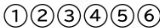

## Finger and string names:

 
#### String symbols:
1 = High E  
2 = B  
3 = G  
4 = D  
5 = A  
6 = E  
#### Left-hand fingers:
1 = index finger  
2 = middle finger  
3 = ring finger  
4 = little finger  
#### Right-hand fingers:
p = thumb (pulgar)  
i = index finger (indice)  
m = middle finger (medio)  
a = ring finger (anular)  
c = little finger (chiquito. d, ñ and ch can also be used)  
## Tonal terms:

## Dynamics:

## Tempo:

## Other terms:

